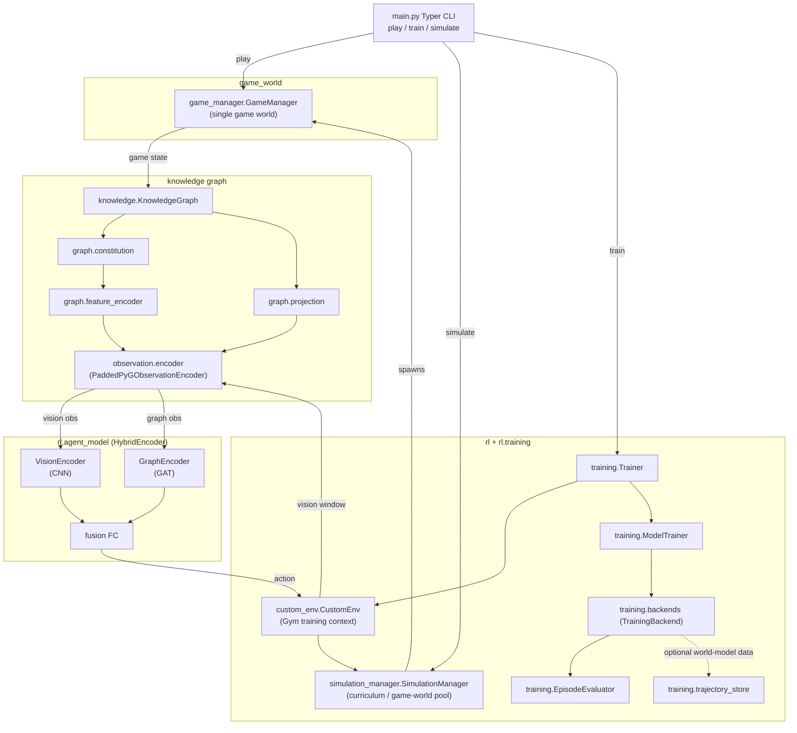

# Knowledge Graph-Enhanced Reinforcement Learning for NPC Decision Making

A research engineering project combining knowledge graphs with reinforcement learning for NPC
decision-making in a custom game environment. The agent navigates a procedurally generated world
modelled as a Travelling Salesman Problem (TSP), using a hybrid CNN-GAT policy that fuses visual
observations with a dynamic knowledge graph built from discovered terrain and entity data. Training
is handled by a composable backend layer (SB3 PPO and DQN) and an ablation study CLI for
systematic experiments across different KG completeness configurations.

## Key Features

- Custom game environment with procedurally generated terrain
- Dynamic Knowledge Graph integration
- Hybrid CNN-GAT model for processing visual and graph-based inputs
- Composable RL backend layer with SB3 PPO and DQN support
- Ablation study across different KG completeness levels

## System Overview



## Project Structure

### `src/tsp_rl_kg` (top level)
Root package containing the CLI entrypoint and shared config contracts: `main.py` (Typer CLI with
`play`, `train`, `simulate` commands), `config.py` (typed dataclasses and enums), and
`renderer.py` (optional Pygame renderer).

### `src/tsp_rl_kg/game_world`
Core simulation domain: environment step/reset coordination, agent state, game entity structures,
procedural terrain generation, and episode lifecycle management.

### `src/tsp_rl_kg/knowledge`
Knowledge graph construction (`knowledge_graph.py`) and index mapping utilities
(`graph_idx_manager.py`).

### `src/tsp_rl_kg/graph`
Graph feature processing: schema/constitution definitions, feature encoding (RawInt / OneHot /
EmbeddingLookup), and projection/transformation of graph outputs.

### `src/tsp_rl_kg/observation`
Observation encoding boundary between the game environment and the RL policy (`encoder.py`).

### `src/tsp_rl_kg/rl`
RL-facing wrappers and model components: Gymnasium-compatible environment, CNN-GAT policy
architecture, reward shaping, and simulation coordination.

### `src/tsp_rl_kg/rl/training`
Training orchestration, ablation studies, evaluation, and backend adapters. Entry point for
ablation runs: `run.py` (`tsp-rl-kg-study`). Backend protocol defined in `backends/base.py`;
Stable-Baselines3 implementation in `backends/sb3.py`.

### `src/tsp_rl_kg/utils`
Shared helpers: JSON/TOML config loading, generic utilities, and logging setup.

## Running the Project

Installed console scripts (from `pyproject.toml`):

- `tsp-rl-kg = tsp_rl_kg.main:main`
- `tsp-rl-kg-study = tsp_rl_kg.rl.training.run:main`

### Non-RL / world commands (`tsp-rl-kg`)

```bash
uv run tsp-rl-kg play
uv run tsp-rl-kg play --random-actions
uv run tsp-rl-kg simulate
```

`play` opens a keyboard-controlled session by default. Controls: `WASD` move, `Q` scout,
`E` build path, `R` place rock, and `IJKL` collect from adjacent tiles. Use
`--random-actions` for autoplay.

### RL training via main CLI (`tsp-rl-kg`)

```bash
uv run tsp-rl-kg train --algorithm PPO
uv run tsp-rl-kg train --algorithm DQN
uv run tsp-rl-kg train --config configs/train.json
uv run tsp-rl-kg train --config configs/train_namespaced.json
```

### Ablation study CLI (`tsp-rl-kg-study`)

```bash
uv run tsp-rl-kg-study --config configs/ablation.toml
```

## Configuration Shapes (Concise)

Both CLIs accept JSON or TOML.

- `tsp-rl-kg` (`src/tsp_rl_kg/main.py`) loads training config from the first matching mapping among:
  - root object
  - `train`
  - `training`
  - `main.train`
  - `base_config`
- `tsp-rl-kg-study` (`src/tsp_rl_kg/rl/training/run.py`) loads study config from the first matching mapping among:
  - root object
  - `ablation`
  - `study`
  - `run`

Within study config, the base training config can be provided under `base_config` (or `training` / `training_config`).

## Architecture Diagrams

Detailed architecture diagrams are maintained in `docs/mermaid_diagrams/` and aligned with the current code:

- [`training_backend_protocols.md`](docs/mermaid_diagrams/training_backend_protocols.md): backend contracts in `rl/training/backends/base.py`.
- [`training_sb3_backend.md`](docs/mermaid_diagrams/training_sb3_backend.md): SB3 backend internals (`rl/training/backends/sb3.py`).
- [`training_orchestration.md`](docs/mermaid_diagrams/training_orchestration.md): interaction across `trainer.py`, `environment_manager.py`, `curriculum.py`, `evaluation.py`, and `trajectory_store.py`.
- [`kg_observation_flow.md`](docs/mermaid_diagrams/kg_observation_flow.md): knowledge-graph constitution/projection/encoding and observation assembly.

## Docs Index

- Root documentation:
  - [`README.md`](README.md)
- Module READMEs:
  - [`src/tsp_rl_kg/README.md`](src/tsp_rl_kg/README.md) - top-level package overview.
  - [`src/tsp_rl_kg/game_world/README.md`](src/tsp_rl_kg/game_world/README.md)
  - [`src/tsp_rl_kg/knowledge/README.md`](src/tsp_rl_kg/knowledge/README.md)
  - [`src/tsp_rl_kg/graph/README.md`](src/tsp_rl_kg/graph/README.md)
  - [`src/tsp_rl_kg/observation/README.md`](src/tsp_rl_kg/observation/README.md)
  - [`src/tsp_rl_kg/rl/README.md`](src/tsp_rl_kg/rl/README.md)
  - [`src/tsp_rl_kg/rl/training/README.md`](src/tsp_rl_kg/rl/training/README.md)
  - [`src/tsp_rl_kg/rl/training/backends/README.md`](src/tsp_rl_kg/rl/training/backends/README.md)
  - [`src/tsp_rl_kg/utils/README.md`](src/tsp_rl_kg/utils/README.md)
- Mermaid diagrams:
  - [`docs/mermaid_diagrams/system_overview.md`](docs/mermaid_diagrams/system_overview.md)
  - [`docs/mermaid_diagrams/training_backend_protocols.md`](docs/mermaid_diagrams/training_backend_protocols.md)
  - [`docs/mermaid_diagrams/training_sb3_backend.md`](docs/mermaid_diagrams/training_sb3_backend.md)
  - [`docs/mermaid_diagrams/training_orchestration.md`](docs/mermaid_diagrams/training_orchestration.md)
  - [`docs/mermaid_diagrams/kg_observation_flow.md`](docs/mermaid_diagrams/kg_observation_flow.md)

## Background

This project originated as a master's thesis at the University of Gothenburg (2024), investigating
neuro-symbolic approaches to NPC decision-making by combining knowledge graphs with reinforcement
learning. Since submission it has continued to evolve as a standalone research engineering
project - the codebase has been substantially refactored, extended with a composable backend layer,
and equipped with an ablation study framework that did not exist in the original thesis.

[Read the full thesis (PDF)](https://gupea.ub.gu.se/bitstream/handle/2077/86450/CSE%2024-36%20AM.pdf?sequence=1&isAllowed=y)

## Contributing

All changes to `main` must go through a pull request. Direct pushes to `main` are not allowed, including for the maintainer.

Before opening a pull request, bootstrap the repository and run the same checks that CI enforces:

```bash
uv sync
uv run pre-commit install
uv run pre-commit run --all-files --show-diff-on-failure
uv run pytest tests/ -v
```

Create a topic branch from `main` for each change using one of these prefixes: `feature/`, `fix/`, `chore/`, `docs/`, `refactor/`, or `test/`.

Maintainer-authored pull requests may merge once all required checks pass. Pull requests authored by anyone else require an approving review from `@antoniomangoni` before merge.

## Contact

Antonio Mangoni: antoniomangoni@gmail.com
