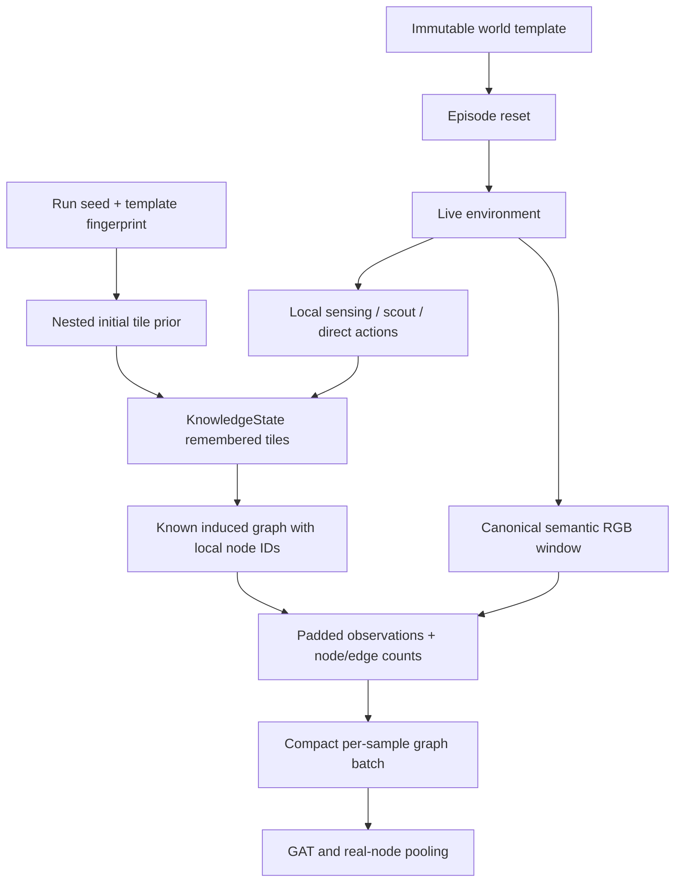

# Knowledge and observations (schema v2)

Completeness affects initial knowledge only. Sensing controls visual discovery independently.
Unseen changes never refresh memory. Episode reset restores the pristine world and prior.
The player is separate from underlying entities and encoded exclusively by its feature encoder.
