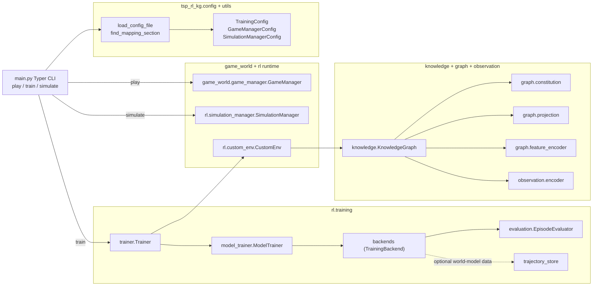

# System overview (`main.py` and package boundaries)

Related diagrams:
- [Training backend protocols](training_backend_protocols.md)
- [SB3 backend internals](training_sb3_backend.md)
- [Training orchestration](training_orchestration.md)
- [KG and observation flow](kg_observation_flow.md)
