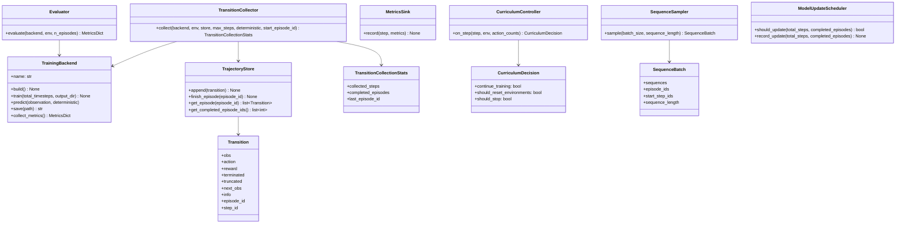

# Training backend protocols (`rl/training/backends/base.py`)

```mermaid
classDiagram
    class TrainingBackend {
      +name: str
      +build() None
      +train(total_timesteps, output_dir) None
      +predict(observation, deterministic)
      +save(path) str
      +collect_metrics() MetricsDict
    }

    class Evaluator {
      +evaluate(backend, env, n_episodes) MetricsDict
    }

    class CurriculumController {
      +on_step(step, env, action_counts) CurriculumDecision
    }

    class MetricsSink {
      +record(step, metrics) None
    }

    class TrajectoryStore {
      +append(transition) None
      +finish_episode(episode_id) None
      +get_episode(episode_id) list~Transition~
      +get_completed_episode_ids() list~int~
    }

    class SequenceSampler {
      +sample(batch_size, sequence_length) SequenceBatch
    }

    class TransitionCollector {
      +collect(backend, env, store, max_steps, deterministic, start_episode_id) TransitionCollectionStats
    }

    class ModelUpdateScheduler {
      +should_update(total_steps, completed_episodes) bool
      +record_update(total_steps, completed_episodes) None
    }

    class CurriculumDecision {
      +continue_training: bool
      +should_reset_environments: bool
      +should_stop: bool
    }

    class Transition {
      +obs
      +action
      +reward
      +terminated
      +truncated
      +next_obs
      +info
      +episode_id
      +step_id
    }

    class SequenceBatch {
      +sequences
      +episode_ids
      +start_step_ids
      +sequence_length
    }

    class TransitionCollectionStats {
      +collected_steps
      +completed_episodes
      +last_episode_id
    }

    Evaluator --> TrainingBackend
    CurriculumController --> CurriculumDecision
    TransitionCollector --> TrainingBackend
    TransitionCollector --> TrajectoryStore
    SequenceSampler --> SequenceBatch
    TrajectoryStore --> Transition
    TransitionCollector --> TransitionCollectionStats
```

Related diagrams:
- [SB3 backend internals](training_sb3_backend.md)
- [Training orchestration](training_orchestration.md)
