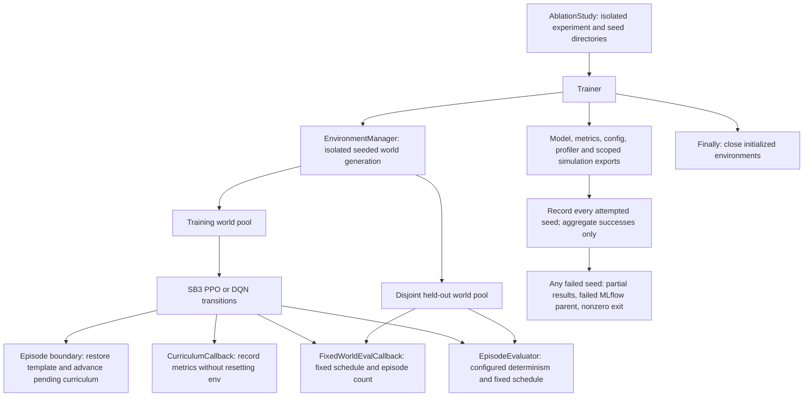

# Training orchestration

Trajectory collectors, stores, sequence samplers and model-update schedulers remain
standalone experimental utilities; active SB3 training does not invoke them.

- [Training backend protocols](training_backend_protocols.md)
- [SB3 backend internals](training_sb3_backend.md)
