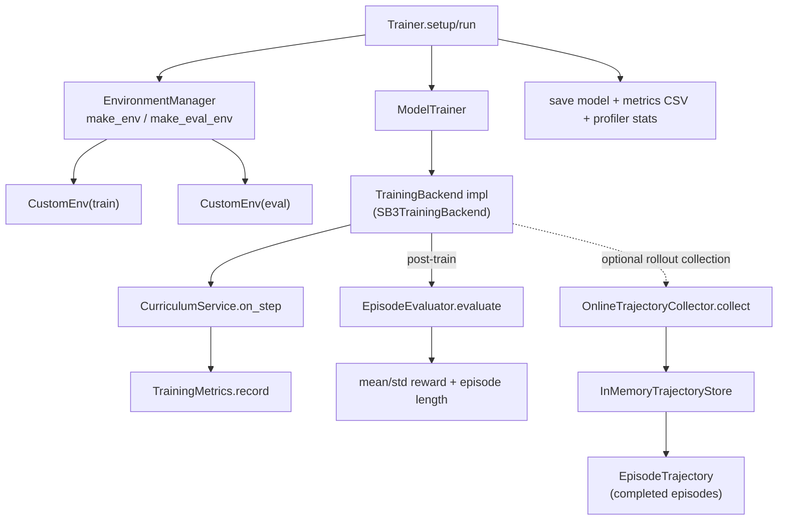

# Training orchestration (`trainer.py`, `environment_manager.py`, `curriculum.py`, `evaluation.py`, `trajectory_store.py`)

Related diagrams:
- [Training backend protocols](training_backend_protocols.md)
- [SB3 backend internals](training_sb3_backend.md)
